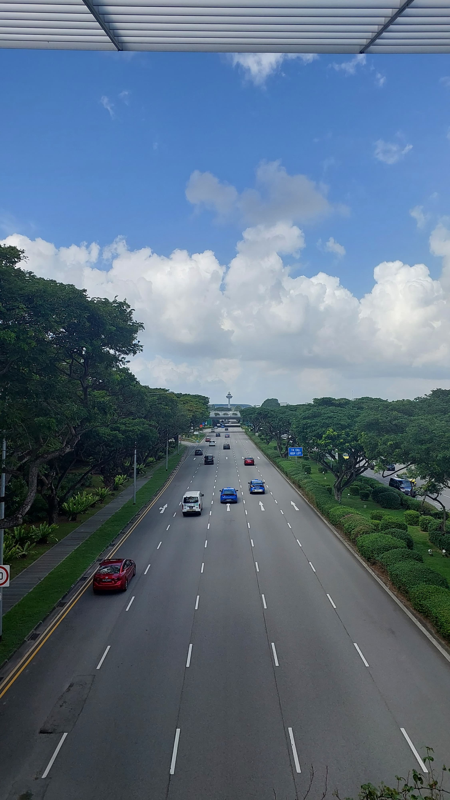

## Find this location

### How it works.
You will be provided with a picture(shown below). You are supposed to find coordinates of it. 
Submit your answer as FLAG{latitude,longitude}. Round EACH value to 4dp.

For example, if the coordinates are (10.2345678,50.98765454), submit the value FLAG{10.2346,50.9877}.

### How to solve
1. Open google maps and try to location where the picture was taken. 

### Find me

